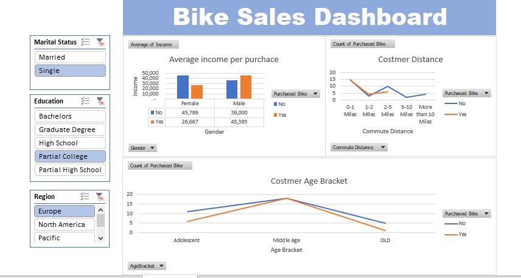

# Bike Sales Dashboard

This repository contains an interactive **Bike Sales Dashboard** created in Microsoft Excel. The dashboard provides insights into customer demographics, purchase patterns, and commute distances.

## Features

1. **Filters**:
   - **Marital Status**: Filter data based on marital status (Married/Single).
   - **Education**: Filter data based on the education level (Bachelors, Graduate Degree, High School, etc.).
   - **Region**: Filter data by region (Europe, North America, Pacific).

2. **Charts and Visualizations**:
   - **Average Income per Purchase**:
     - Displays the average income of customers who purchased a bike, segmented by gender.
   - **Customer Distance**:
     - Shows the commute distance of customers who purchased bikes, segmented by purchase decision.
   - **Customer Age Bracket**:
     - Illustrates the age bracket of customers and their purchase decision.

## File Overview

- **Bike.png**: Screenshot of the dashboard showcasing the visual insights and interactivity.
- **Dashboard Excel File**: Contains the original Excel workbook with the interactive dashboard and slicers.

## How to Use

1. Open the Excel file containing the dashboard.
2. Use the slicers (Marital Status, Education, Region) to filter the data dynamically.
3. Analyze the provided visualizations to gain insights into customer behavior and sales trends.

## Insights Provided

- Income distribution based on gender and purchase decision.
- Customer commute distance and its correlation with bike purchases.
- Purchase trends across different age brackets.

## Requirements

- **Microsoft Excel**: The dashboard utilizes features such as slicers and pivot charts, which are available in most modern versions of Excel.

## Preview

## License

This project is licensed under the MIT License. Feel free to use, modify, and share it.

## Author

Created by **Anil Balu Amrute**. For any queries, contact me at [anilamrute1@gmail.com](mailto:anilamrute1@gmail.com).
